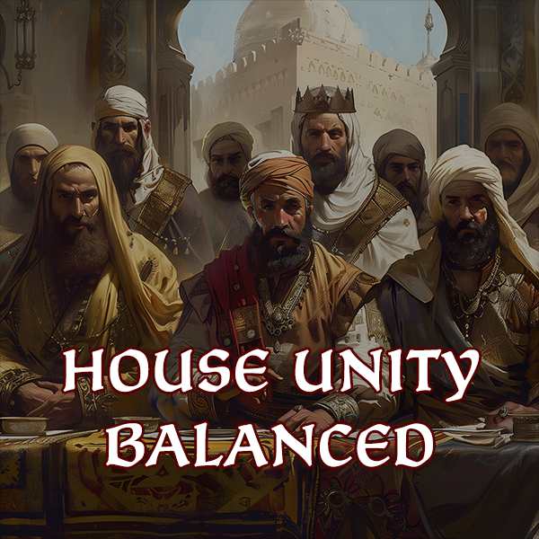

<h1 align="center">
  
</h1>

  
  
  

**House Unity Balanced** is a Crusader Kings 3 mod, designed to rework and adjust aspects of House Unity, "a measure of the internal stability in the ruling house of a Clan realm".

The motivation is straight-forward; as a house grows over time, the proportional power of each individual member is _significantly_ reduced. Since there are more unity-reducing actions, such as imprisonment and demand artifact, than promoting ones, the house unity almost always tends towards antagonistic, with little the player can do to swing the scale. This is exacerbated by the fact that cadets branches may only be created by independent rulers in the base game.

The primary features of this mod is dynamic scaling of house unity changes: if there are more house members, measured by the number of landed characters, the less impactful each individual action will be.

## Notable Features

- Dynamic House Unity scaling
- Applied House head modifier for either side of interaction
- Equilibrium House Unity value
- Artifact interaction improvements
  - Disallow demand/challenge for Artifact against a House member without a personal claim
  - Adjust House Unity/Opinion changes based on Artifact quality and hostility of interaction
  - Add additional AI acceptance modifiers for demand artifact
  - Ensure House Unity change only occurs if the Artifact changes hand
  - Add event for failed steal Artifact scheme target
- Artifact War and Reclaim Relic War improvements
  - Adjust prestige cost based on Artifact quality
  - Change Artifact history and claim from defender to Artifact owner
- Tweaked character interaction (e.g. lover, rival) House Unity changes
- Improved House Unity history descriptions
- Allowed clan vassal Create Cadet Branch Decision
  - Independent, Vassal, Vassal (House) tiers
  - House Founder Trait
- Khums[^1] Tax Decree
  - 20% extra tax and levies contribution from house-member vassals
  - Yearly house unity loss, negative liege opinion, etc.

## Roadmap

- [x] Dynamic Scaling
- [x] Artifact Interactions
- [x] Artifact Wars
- [x] Character Interactions
- [ ] Diplomatic Interactions
- [ ] Intrigue Schemes
- [x] Cadet Branch Decision
- [ ] Documentation
- [x] Thumbnail
- [x] Steam Workshop

## License

This mod is licensed under the **BSD-2-Clause Plus Patent License**.

This license is designed to provide: a) a simple permissive license; b) that is compatible with the GNU General Public License (GPL), version 2; and c) which also has an express patent grant included.

 **NOTE: this license does NOT cover any part of the scripts, localization or other files which is derived or copied from the base CK3 game, which is published and licensed by Paradox Interactive.**

[^1]: This is **not** based on the historic [khums](https://en.wikipedia.org/wiki/Khums) tax found in Islamic taxation system, where muslims paid the tax for certain types of income. It simply borrows the literal meaning of the word, "one-fifth", for this use case.
